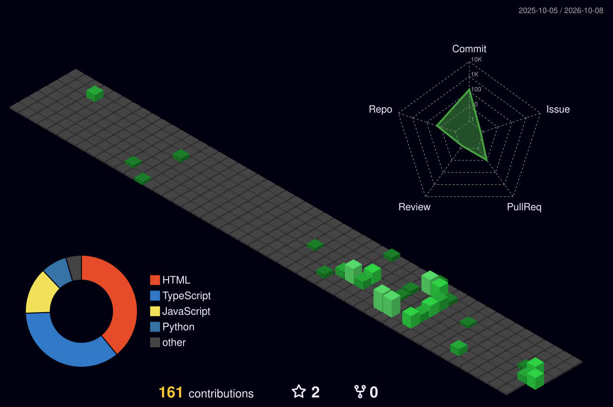

<p align="center">
  
</p>

<p align="center">
  
</p>

<p align="center">
  <a href="https://www.linkedin.com/in/suriyaganeshv/"></a>
  <a href="mailto:suriyaganesh894@gmail.com"></a>
  
</p>

<table>
<tr>
<td width="55%" valign="top">

```bash
suriya@github:~$ whoami
Software Engineer · Chennai, India

suriya@github:~$ cat about.txt
I build systems, then I test them
until they hold.

suriya@github:~$ cat now.txt
Developer on an AI knowledge base
platform: RAG · Claude · MCP
```

</td>
<td width="45%" valign="top">

**⚡ At a glance**

- 🧠 Building **RAG pipelines** and a custom **MCP server** with Claude
- ☕ **Spring Boot microservices** with API Gateway, OAuth2 and RBAC
- 🏦 **ISO 20022** payment validation for SWIFT SR2025 at BNY
- 🐞 Found **50+ critical defects** in an AI platform, then helped build it
- 🧪 Automation with **Selenium**, **TestNG**, JIRA and Zephyr Scale
- 🎓 B.Tech CSE · **CGPA 8.88** · 16 certifications

</td>
</tr>
</table>

<h2 align="center">🛠️ Tech stack</h2>

<table align="center">
<tr><td align="right"><b>Backend</b></td><td></td></tr>
<tr><td align="right"><b>Frontend</b></td><td></td></tr>
<tr><td align="right"><b>Data</b></td><td></td></tr>
<tr><td align="right"><b>Testing</b></td><td>    </td></tr>
<tr><td align="right"><b>AI</b></td><td>      </td></tr>
<tr><td align="right"><b>Payments</b></td><td>    </td></tr>
<tr><td align="right"><b>Tools</b></td><td></td></tr>
</table>

<h2 align="center">📊 GitHub analytics</h2>

<p align="center">
  
  
</p>

<p align="center">
  
</p>

<h2 align="center">🧊 Contributions in 3D</h2>

<p align="center">
  
</p>

<h2 align="center">🐍 Snake mode</h2>

<p align="center">
  <picture>
    <source media="(prefers-color-scheme: dark)" srcset="https://raw.githubusercontent.com/SuriyaG894/SuriyaG894/output/github-contribution-grid-snake-dark.svg">
    <source media="(prefers-color-scheme: light)" srcset="https://raw.githubusercontent.com/SuriyaG894/SuriyaG894/output/github-contribution-grid-snake.svg">
    
  </picture>
</p>

<details>
<summary><b>🏅 Certifications (16)</b></summary>
<br>

| Issuer | Certification |
| --- | --- |
| Oracle | Certified Associate, Java SE 8 Programmer |
| Oracle | Certified AI Foundations Associate |
| Databricks | Generative AI Fundamentals |
| Databricks | AI Agents Fundamentals |
| Wipro | Java Full Stack Developer |
| Google | AI Essentials Specialization |
| IBM SkillsNetwork | Prompt Engineering for Everyone |
| Microsoft | AI Skills Fest |
| Udacity | AWS AI Practitioner Challenge |
| Global AI Community | Agents League: Creative Apps |
| NPTEL | Programming in Java |
| Microsoft | MTA: Introduction to Programming using JavaScript |
| Certiport | IT Specialist: Python |
| — | Python Basics for Data Science |
| Udemy | ZeroToHero TestNG Framework |
| Coding Ninjas × Google for Developers | Vibe2Ship Vibe Coding Hackathon (participation) |

</details>

<p align="center">
  <a href="mailto:suriyaganesh894@gmail.com"></a>
</p>

<p align="center">
  
</p>
