<p align="center">
  
</p>

<p align="center">
  <a href="mailto:suriyaganesh894@gmail.com"></a>
  <a href="https://www.linkedin.com/in/suriyaganeshv/"></a>
  <!-- After your portfolio is live on GitHub Pages, uncomment this badge:
  <a href="https://suriyag894.github.io"></a>
  -->
</p>

### `~/projects`

<p align="center">
  
</p>

### `$ top --skills`

<p align="center">
  
</p>

### `$ git log career`

<p align="center">
  
</p>

<details>
<summary><b><code>$ ls ~/certifications</code> &nbsp;(16 files)</b></summary>
<br>

```text
oracle/      Certified Associate, Java SE 8 Programmer
oracle/      Certified AI Foundations Associate
databricks/  Generative AI Fundamentals
databricks/  AI Agents Fundamentals
wipro/       Java Full Stack Developer
google/      AI Essentials Specialization
ibm/         Prompt Engineering for Everyone
microsoft/   AI Skills Fest
udacity/     AWS AI Practitioner Challenge
global-ai/   Agents League: Creative Apps
nptel/       Programming in Java
microsoft/   MTA: Introduction to Programming using JavaScript
certiport/   IT Specialist: Python
misc/        Python Basics for Data Science
udemy/       ZeroToHero TestNG Framework
coding-ninjas/ Vibe2Ship Vibe Coding Hackathon (participation)
```

**Education:** B.Tech, Computer Science Engineering · Sri Manakula Vinayagar Engineering College · CGPA 8.88

</details>

<p align="center">
  <a href="mailto:suriyaganesh894@gmail.com"></a>
</p>
